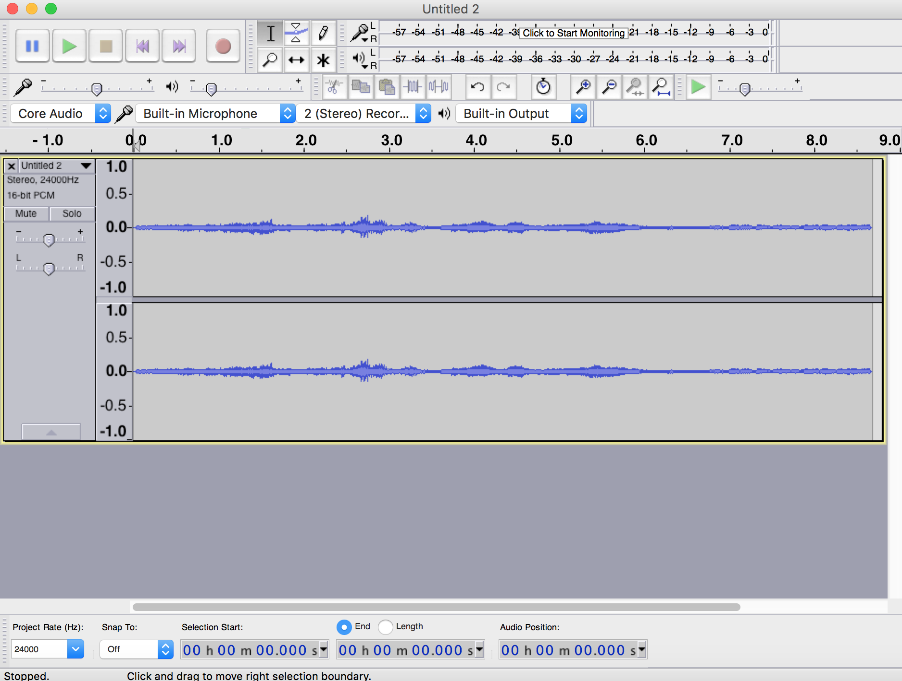
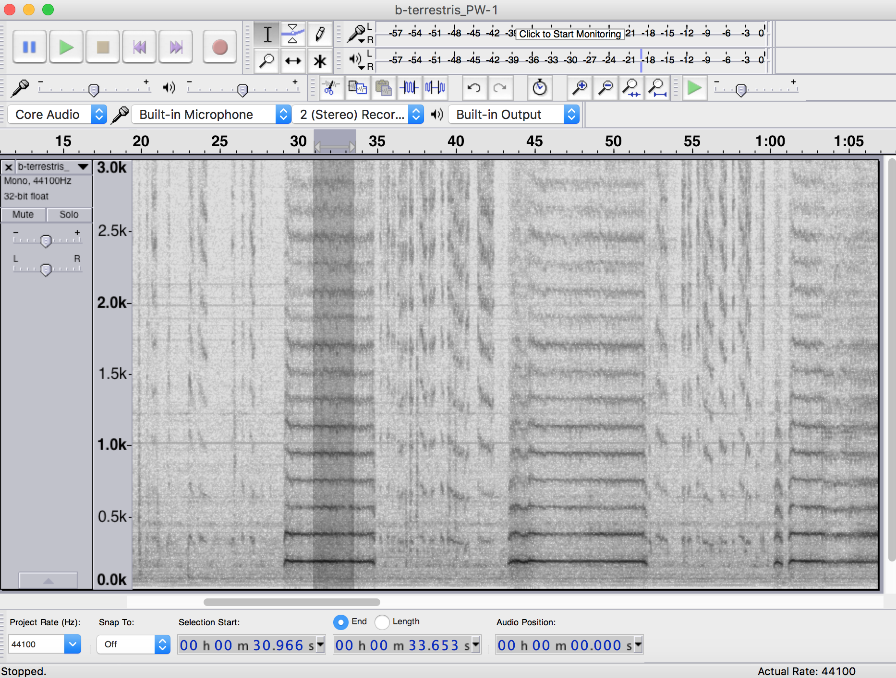
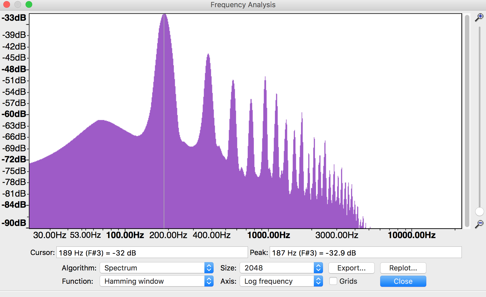
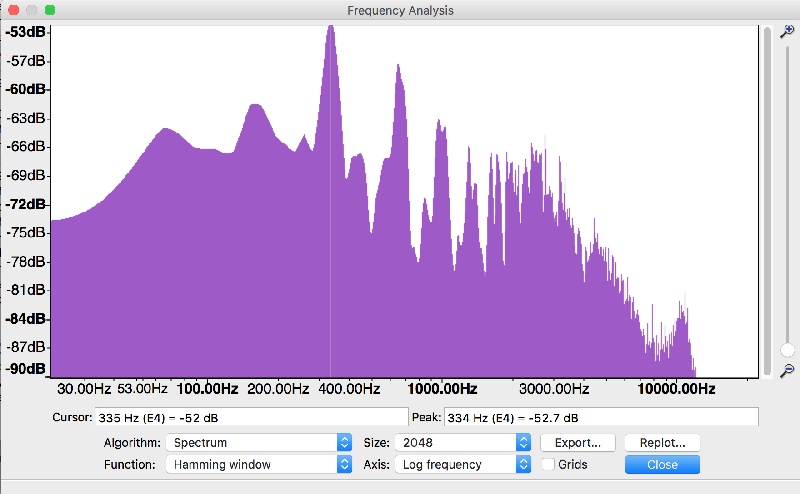

### Unicamp Course. 20-22 March 2017 
### Mario Vallejo-Marin.


# Experimental approaches: Buzz pollination
-----

## Introduction

**Buzz pollination** is a mode of pollination that involves insects, usually bees, using high frequency vibrations to remove pollen from flowers. 


**Figure 1.** Bumblebee (*Bombus terrestris*) buzzing a flower of *Solanum dulcamara* (Solanaceae) in Scotland.

Most insects capable of buzz pollination are bees. Bees use their thoracic flight muscles to produce high frequency vibrations (hundreds of Hz). The vibrations are transmitted to the flower through the contact between the pollinator's body and the floral organs, usually the anthers. 

Buzz-pollination is often used to refere to the phenomenon of producing vibrations to extract pollen from flowers. However, 'pollination' implies the transfer of pollen between anthers and stigmas, so it is useful to differentiate the process of producing vibrations (sonication), and the reproductive consequences for the plant (pollination). See glossary below.

## Analysis of vibrations
Studies of buzz pollination often require characterising the types of vibrations produced by bees while extracting pollen.

Vibrations can be experimentally studied in two ways:

1. **Direct approaches.** Involve analysing the charactersitics of the vibrating bodies themselves. The vibrating body could be the bee, or the flower that is directly into contact with the bee. Direct measurements of vibrations can be made with specialist equipment such as a [laser Doppler vibrometer](https://en.wikipedia.org/wiki/Laser_Doppler_vibrometer). An example of a laser vibrometer that our lab has used in the past can be found here: [Laser vibrometer](http://www.polytec.com/uk/products/vibration-sensors/single-point-vibrometers/complete-systems/pdv-100-portable-digital-vibrometer/)

2. **Indirect approaches.** Involve analysing the byproduct of the vibrations produced by the bee. The vibrations produced by the bee and transmitted to the flower, result in an audible signal: the "buzz" in buzz-pollination. This acoustic signal can be recorded and analysed using an audio recorder. The advantage of recording the acoustic signal produced during **sonication** is that this can be done with relatively simple equipment (your mobile phone may give you a good first approximation to the characteristics of a buzz). The disadvantages include the intrusion of background noise (from wind to bird calls), which can render a recording useless. Additionally, some parameters of the buzz, such as intensity or amplitude are heavily affected by the distance between the recording apparatus and the bee, and hence it is difficult to get accurate measurements of buzz intensity under field conditions.

# Acoustic analysis of buzz pollination

The vibrations produced by the bee, are propagated through the air, producing audible sounds. These sounds are our indirect way to characterise the vibrations produced by the bee. Sounds are waves that propagate through the air or other media. The main charactersitics of waves are:

1. Wavelength: The distance between peaks or throughs
2. Period: The amount of time that takes a whole wave to pass through a fixed point
3. **Amplitude**: The height of a wave
4. **Frequency**: The number of waves that pass through a fixed point per unit time. Usually measured in cycles (number of waves) per second or **Hertz (Hz)**.
5. **Acceleration**: The maximum velocity of a wave passing through a fixed point.


Figure 2. Main charactersitics of waves. From: theory.uwinnipeg.ca

Because pollen released from anthers is a function of the amount of energy transmitted from the bee to the stamen, we will focus on three main characteristics of sonication: (1) Amplitude/Acceleration, (2) Frequency, and (3) Duration (the amount of time spent buzzing).

Amplitude and acceleration are related to each other. Specifically:

	a_max = A (2 pi f)^2

Where *a_max* is maximum acceleration, *A* is amplitude in meters, and *f* is frequency in Hz.

Thus, if you keep frequency constant, an increase in amplitude will result in a proportional increase in acceleration. 

##1. Analysis using *Audacity*
The analysis of acoustic signals can be done with a variety of software. The software that most people use has usually been developed for the music industry, but it contains the necessary tools to describe sounds

Here we will use a freely available software called *Audacity*. 

**The goal of this exercise is to give you a brief tutorial for analysing bee buzzes, and characterise their basic properties.**

### 1.1 Download and install *Audacity* in your computer
You can donload Audacity 2.1.2 from: [http://www.audacityteam.org](http://www.audacityteam.org)

### 1.2 Adjust *Audacity* settings

1. Open *Audacity*
2. Import audio file (e.g. 'test.wav')
3. Clicking the space bar will start playing the audio file. To pause it press the space bar again.
3. Once the file is open, click to the left of the **tracks** to select (highlight) the recording. This displays the recoding in **waveform**.

	

2.	Go to: Edit → Preferences → Spectrograms. Select: size 8192; type ‘Hamming’; maximum frequency 3000; grayscale.
3.	Click the small upside-down black triangle to the right of the filename. Select ‘Spectrogram’. This will display the recording as a **spectrogram**.
	
4.	Go to: Effect → High Pass Filter. Select: rolloff 12 db; cutoff 100 Hz. If you are working on a MAC you may have to follow a different path to adjust these settings.
5. If your audio was recorded in stereo (e.g., with the H4 Zoom Recorder) you will see the two channels of the audio. To simplify things we will analyse only one channel. To do this, go to the inverted black triangle to the right of the file name, choose *Split Stero to Mono*, and then close the bottom panel. You can stretch out the Spectrogram area using the mouse to fill your screen.

### 1.3 Analysis
Now that you have the audio file in a format that we can analyse, the next step is to select a section of the file that contains a clear buzz (e.g., a flight buzz or a feeding sonication). You should conduct the analyses below separately for each buzz. For each separate buzz, carry out the following steps.

1.	Highlight the buzz using the mouse. Make sure to include only the buzz you want to analyse, and use the zoom function if needed for increased accuracy. 
2.	Go to: `Analyze → Plot Spectrum`. This will plot the **frequency spectrum** for the portion of the recording you highlighted. The analysis is much simpler if you focus on clear recordings without background noise.
3. Select: `algorithm ‘Spectrum’`;  `function ‘Hamming window’`; `size 8192`; `axis ‘Log frequency’`.
	The `size` value is somewhat subjective. We have found that values between **1024** and **8192** work in different situations. But remember you must use consistent setting for all the analysis in your project.
3.	Mouse over the highest peak after 50-100 Hz (the signal below 50 Hz is most likely background noise). **The peak frequency and corresponding amplitude appears beneath the graph**. Record these figures in a spreadsheet, making sure to note what type of behaviour they refer too (flight or sonication), the identity of the bee, and other relevant experimental data.
4. To account for variation between buzzes and experimental error, you should measure multiple buzzes per bee per behaviour.



**Figure.** Example of a flight buzz.


**Figure.** Example of a sonication buzz.

## 2. Machine learning

In 2015, a Slovenian data scientist [Bostjan Kalusza](http://bostjankaluza.net/classifying-animal-sounds/) and his colleagues, developed a new approach at analysing buzzing sounds. They used machine learning techniques to train a computer program to recognise some of the main European species of bumblebees. The paper can be found [here](http://www.tandfonline.com/doi/abs/10.1080/09524622.2016.1190946).

The result allows users to input a sound file (in *.wav* format) into a webpage, and the program will return the three most likely hits of what the bumblebee species may bee. You can try it in the link below.

[Automatic recognition of European bumblebees] (http://animal-sounds.ijs.si/recognition/bumblebees)

Because the algorthim only works at the moment with European species, I have made available a sound file from a bee we recorded in Scotland. The file is of a worker of *Bombus terrestris* visiting a flower of *Solanum rostratum*.

To try this automatic recognition software, follow these steps:

1. Download a sample buzz file (.wav format) from: [www.plant-evolution.org/campinas](http://www.plant-evolution.org/campinas), and save this file to your local computer.
2. Navigate to Animal Sounds website [http://animal-sounds.ijs.si](http://animal-sounds.ijs.si)
2. Navigate to *Bumblebees* and click *Recognize*
3. Upload the sound file. The sounds recognistion will start automatically
4. The result will be a list of candidate species as identified by the machine-learning algorithm in rank order.

```
What are the advantages and limitations of this automatic recognition approach?
How would you build up this system?
Is this a useful tool for assessing levels of biodiversity?
What are the advantages and limitations of this automatic recognition approach?
```

# Assignment

**Objective:** To build a library of flight and feeding buzzes, and analyse the types of vibrations produced by different bee species.

1. Work in groups (2-4 people per group)
2. Go out and record bee buzzes using a hand-held microphone. You can use your mobile phone microphone if you wish. Remember to avoid background noise as much as possible. Even light sounds in the background will complicate the analysis.
3. Remember to record the species of bee and the type of flower being visited. 
3. Bring back your recordings to the lab, and analyse them using the methodology described above.
4. Record the frequency, amplitude and duration of the buzzes of each species of bee you sample.
5. Analyse your results by producing tables or figures of your main findings.


## Glossary

* **Sonication:** A behaviour displayed by some insects, usually bees, that involves the production of high frequency vibrations to facilitate pollen collection.
* **Buzz-pollination:** A type of pollination in which pollen transfer is mediated by insects that use high frequency vibrations to collect pollen grains. It usually, but not always, involves plant species with non-dehiscent anthers, including poricidal anthers.
* **Poricidal anthers:** Non-dehiscent anthers that open through small pores or slits, usually at the distal end of the anther.
* **Stamen:** Male reproductive organ of angiosperms that is formed of a filament and an anther containing the pollen grains.

--


