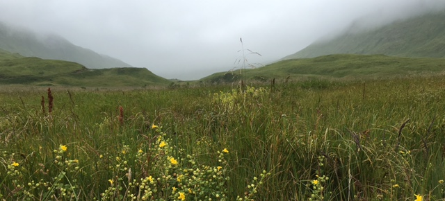

#Modeling population growth in clonal plants

Many plants combine sexual (seeds) and asexual (clonality, apomixis) modes of reproduction. In organisms with mixed modes of reproduction, we need a way to quantify the contribution of both seeds and clones to fitness.

Here we will se how we can use estimates of population growth as a measure of fitness. We will analyse demographic models to project the rate of growth of a population (or a group of individuals with similar characteristics).

##Primer on building demographic models
*Morris, W.F. and Doak, D.F., 2002. [Quantitative Conservation Biology](https://www.sinauer.com/quantitative-conservation-biology-theory-and-practice-of-population-viability-analysis.html). Sinauer, Sunderland, Massachusetts, USA.*

Populations in which individuals differ in their contribution to population growth are called **structured populations**. The growth of structured populations is studied using **population projection matrix** models. These models divide the population into discrete classes of individuals, and estimates the contribution of each class to the number of individuals in all classes in the following census. The classes of individuals can be defined by their age, size, or stage.

Individuals within a structured population can differ in three types of demographic processes:

1. Survivorship
2. Growth (transition from one stage to another)
3. Fertility, or number of offspring (propagules) contributed to the next census

These are called **vital rates**.

A projection matrix model allows estimating how differences in vital rates, together with the proportion of individuals in each class, affects population growth.

###1. Conducting a demographic study
This is the first step in building a projection matrix. It requires following marked individuals over consecutive censuses (and ideally over multiple censuses). Following the fate of these marked individuals then allows estimating the vital rates required for a projection matrix model.

This is a key step, as all the other analyses rest in getting good demographic data. Individuals studied should be representative of the population. The marked individuals should be sampled at regular intervals (e.g., over a one-year interval). In some cases, it may be necessary to census individuals more than once a year. For example, we may want to distinguish summer and winter survival).

###2. Establishing classes of individuals
The first step is to decide whether to classify individuals by age, size or stage. You can also combine them (1-year old seedling, 2-year old seedling). The classification depends on biological information about the organism (e.g., does it make more sense to classify plants by age or size?), and practicality. Alternatively, you can use statistical analyses to identify state variables that best predict differences in vital rates among individuals (see page 187 of M&D2002).

###3. Estimating vital rates

