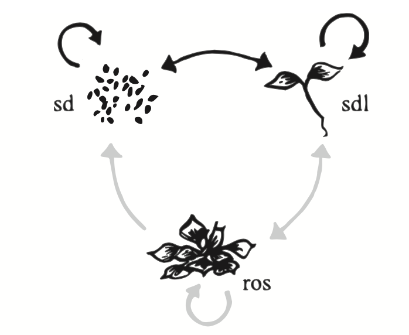

```{r setup, include=FALSE}
knitr::opts_chunk$set(echo = F)
```

### Building a projection matrix

Once you have calculated the demographic rates of **survival**, **growth or transition rates**, and **fertility**, you can build a projection matrix.

A typical matrix in which there are three stages (e.g., seedling, juvenile, and adult), looks like this:

$$\mathbf{A} = \left[\begin{array}
{rrr}
a_{11} & a_{12} & a_{13} \\
a_{21} & a_{22} & a_{23} \\
a_{31} & a_{32} & a_{33}
\end{array}\right]
$$

where the $a$ represent transition probabilities. \*The transition rates represent the movement of the **j_th column** stage to the **i_th row** stage $P_{ij}$.

In an organism where there are three pre-reproductive stages, and one reproductive stage, the projection matrix $A$ may look like this:

$$\mathbf{A} = \left[\begin{array}
{rrrr}
P_{11} & 0 & 0 & F_4 \\
P_{21} & P_{22} & P_{23} & 0\\
0 & P_{32} & P_{33} & 0\\
0 & 0 & P_{43} & P_{44}
\end{array}\right]
$$
where $P$ represent the transition probabilities between stages $P_{ij}$ or within a stage $P_{ii}$. The element $F$ is reserved for *reproduction*. A matrix entry of zero indicates that the transition does not occur.

To build the matrix you need to combine the vital rates to generate each matrix element, where:

 - $s_j$ is the survival rate of class $j$
  - $f_j$ is the fertility rate for class $j$
   - $g_{ij}$ is the probability that an individual in class $j$ in this census makes the transition to class $i$

###An example with clonal *Mimulus*
Here we will use a recent example of estimating population growth rate in *Mimulus* populations reproducting both sexually and clonally. This study was conducted by Megan Peterson and colleagues:

[Peterson ML, Kay KM, Angert AL (2016) The scale of local adaptation in *Mimulus guttatus*: comparing life history races, ecotypes, and populations. *New Phytologist*, 211, 345–356.](Peterson_et_al_2016.pdf)

[Suplementary Material](nph13971-sup-0001-SupInfo.pdf)

The general life cycle of *Mimulus* is shown here:

 

**Figure**. Life cycle graph of *Mimulus*. Black arrows indicate transitions for annuals, and grey+black are transitions for perennials. From Peterson et al. (2016). 

The vital rates for the life cycle graph are given below.

$$\begin{array}
{cccc}
 & Seed_t & Seedling_t & Rosette_t \\
Seed_{t+1} & D(1-G) & FeOA(1-G) & FeOA(1-G) \\
Seedling_{t+1} & DG & FeOAG & FeOAG  \\
Rosette_{t+1} & 0 & SR & SR 
\end{array}
$$

where $D$ is the survival of seeds in the seed bank,  $G$ = germination rate, $O$ = ovule number (a proxy for seed production), $Fe$ = flower number, $S$ = overwinter survival, and $R$ = number of additional vegetative rosettes. For details, see Peterson et al. (2016).

This model estimates yearly transitions  based ona pre-reproductive census, i.e., right at the start of the growth season, just after the snwomelt. After the census, either seedlings or rosettes can flower and contribute to seed or seedling class, or survive to produce vegetative rosettes in the next time step. Seed to seed transitions represent dormancy in the seed bank.

In an annual population, overwinter survival $S$ is zero, and the number of clonal propagules $R$ is also zero. So the matrix above becomes:
$$\begin{array}
{cccc}
 & Seed_t & Seedling_t & Rosette_t \\
Seed_{t+1} & D(1-G) & FeOA(1-G) & FeOA(1-G) \\
Seedling_{t+1} & DG & FeOAG & FeOAG  \\
Rosette_{t+1} & 0 & 0 & 0 
\end{array}
$$

###Analysis with *POPBIO*

Here we will use the `library(popbio)` to analyse population projection models. *popbio* is an package that implements the equations from Caswell (2001), and Morris and Doak (2002) to study matrix populations models.

`popbio` also contains functions to calculate vital rates and construct projection matrices from raw census datas, as is typical of plant demography studies.

First load the library:

```{r load popbio, echo=TRUE}
library(popbio)
```

###Demographic parameters

We will use the the data from Peterson et al. (2016), focusing on three annual and three perennial populations. 

In this step, we will create an object that holds the vital rates for a number of annual and perennial populations. 
```{r parameters, echo=TRUE}
par.dat<-data.frame(pop=c("rh","bm","pb","sf","em","sc"), life.history = c(rep("annual",3),rep("per",3)), 
                    G = c(0.559,0.818,0.740,0.552,0.469,0.410),
                    O = c(286.9,170.9,616.8,803.1,613.9,649.5), 
                    Fe = c(5.28,8.60,8.62,0.40,0.64,0.63),
                    S = c(0,0,0,0.1,0.179,0.158), 
                    R = c(0,0,0,0.82,1.56,0.66))
par.dat
```
Each row represent one population.

The following parameters are the same for all populations:
```{r fixedpar, echo=T}
D = 0.534 # Seedbank survival was treated as a constant across all populations
A = 6.7e-4 #Proportional recruitment of ovules relative to rosettes
```
###Annual population, no clonality 

Now, we need to create the projection matrix. We will begin by analysing one annual population called 'Red Hills'.
```{r projection.matrix, echo=TRUE, message=F}
s1<-subset(par.dat, pop=="rh")   #Subsets only population Red Hills "rh"
s1
attach(s1) #attaches the object so you can call individual elements
#This next step builds the tranistion matric by multiplying the appropriate vital rates:
pmat<-matrix(c(D*(1-G), Fe*O*A*(1-G), Fe*O*A*(1-G),  D*G, Fe*O*A*G, Fe*O*A*G,   0, S*R, S*R),
             nrow=3, ncol=3, byrow=T, 
             dimnames = list(c("seed_t+1","seedling_t+1", "rosette_t+1"),
                             c("seed_t","seedling_t", "rosette_t")))
pmat
detach(s1)  #Detaches the object s1 from memory
```
The most straightforward calculation once the transition amtrix has been generated is to estimate the population growth rate parameter `lambda`:

```{r lambda, echo=T}
lambda(pmat)
```
Is the population shrinking or growing?

###Other analyses
We can also conduct other analysis on this matrix, such as calculating the proportion of individuals in each class at equilibrium, the changes in numbers of individuals through time, and so on. To do that we will use a function called `pop.projection`.

To calculate the projection estimates, we first need to define an initial stage vector (the number of individuals in each of the stage classes). This is often best obtained from census numbers. Here we will use a hypothetical vector given that this was an experimental plot. It is wise to check how sensitive are your findings to different starting conditions.
```{r init.vector, echo=T}
init.vector<-c(rep(100,3))
```

```{r pop.projection, echo=TRUE}
pj1<-pop.projection(pmat, init.vector, iterations=20)
pj1
```
The analysis returns several pieces of information about the population's performance in the future. Let's see each of them in turn.

The eigenvalue, *lambda* is given in:
```{r eigen, echo=TRUE}
pj1$lambda
```

The `stable.stage` element contains the proportion of individuals in the population in each stage, once the equilibrium has been reached.

```{r stablestage, echo=TRUE}
pj1$stable.stage
```

The `stage.vectors` element shows you how the number of individuals in each stage changes through the *x* number of iterations for which you ran your model (20, in this example).

You can see the changes in the proportion of individuals in each class using the `stage.vector.plot` function.

```{r stage.plot, echo=T}
stage.vector.plot(pj1$stage.vectors[,1:11], ylim=c(0,.8))  #Plots initial state and the first ten years
```

The `pop.sizes` element shows you how the population size changes through time, and `pop.changes` give you the proportional change through time.

 - **Can you produce population projection analyses for the other two annual populations?**
 - **Are these populations also shrinking, or are they growing?**

###Perennial population, with clonality
Let's now look at the dynamics of a perennial population. For this we will choose the population 'Eagle Meadows', the local population originary from the same place as the common garden.

For brevity, I will omit the `R` output.

```{r perennial, echo=T, message=F}
s2<-subset(par.dat, pop=="em")   #Subsets only population Red Hills "rh"
s2
attach(s2) #attaches the object so you can call individual elements
pmat.s2<-matrix(c(D*(1-G), Fe*O*A*(1-G), Fe*O*A*(1-G),  D*G, Fe*O*A*G, Fe*O*A*G,   0, S*R, S*R),
             nrow=3, ncol=3, byrow=T, 
             dimnames = list(c("seed_t+1","seedling_t+1", "rosette_t+1"),
                             c("seed_t","seedling_t", "rosette_t")))
detach(s2)
pmat.s2
lambda(pmat.s2)
```

The matrix analysis is done next.

```{r pop.projection.per,  echo=TRUE}
pj2<-pop.projection(pmat.s2, init.vector, iterations=20)
pj2
```

For this perennial population, the value of `lambda` is *`r round (pj2$lambda,3)`*.

And the proportion of individuals in each class can be visualised as before

```{r stage.plot.per, echo=F}
stage.vector.plot(pj2$stage.vectors[,1:11], ylim=c(0,.6))
pj2$stable.stage
```
In this case, about `r round(pj2$stable.stage[3],3)*100`% of the population will occur as rosettes.

You can visualise the change in population size with time. Because `lambda < 1`, we expect this population to eventually become extinct.

```{r popchange, echo=T}
plot(pj2$pop.sizes ~ seq(from=0, to=length(pj2$pop.sizes)-1, by=1), xlab="Years", ylab="Population size", type='l', lwd=2)
```
###Elasticity
We can now look at the effect of slightly changing each of the elements of the transition matrix in population growth rate. We do this by calculating the **elasticities** of the transition matrix.

```{r elasticity, echo=T}
elas<-elasticity(pmat.s2)  #Calculates elasticities
#Plot the eleasticity matrix, with warmer colours indicating larger contributions to population growth rate
image2(elas, mar=c(1,5,5.5,1), cex=0.8, col = c("lightgray", rev(heat.colors(23))))

sum(elas)  # The sum of all the elasticities should add up to one.
```
We can see that the transitions from seedling and rosette to rosettes have high values of elasticity (bottom row of the matrix). In this matrix, such transitions represent the product of plant survivorship and rosette production `S*R`. So, how can we disentangle the contribution of individual vital rates (such as rosette production, `R`)?

###What is the effect of clonality?

####(1) An approach using simulations
A crude approximation to estimate the effect of changing a given vital rate on lambda is to conduct a simulation. This can be easily done in **R** by repeatedly calculating `lambda` for a range of parameter values. For example, let's build a function to calculate `lambda` in an iterative fashion (if you are unfamiliar with how to build loops in R, I will be happy to explain the general logic and point you to online resources to learn how to do it).

The goal is to obtain a data set containing a value of `lambda` for each value of `R`.

```{r loop.lambda, echo=T}
#Simulate different rosette production values:
simR<-function(vitrates){
  lambda.results<-data.frame(R=rep(NA,100),lambda=rep(NA,100)) #Creates a data frame to store the results
  attach(vitrates)
  for (i in 1:100){
    R=i/10  #At every iteration of the loop, the value of R will increase slightly. Change this to test different values of R or different vital rates.
    pmat<-matrix(c(D*(1-G), Fe*O*A*(1-G), Fe*O*A*(1-G),  D*G, Fe*O*A*G, Fe*O*A*G,   0, S*R, S*R),
                nrow=3, ncol=3, byrow=T, 
                dimnames = list(c("seed_t+1","seedling_t+1", "rosette_t+1"),
                                c("seed_t","seedling_t", "rosette_t")))
  lambda.results[i,1]<-R
  lambda.results[i,2]<-lambda(pmat)
  }
  #print(lambda.results) #Uncomment this if you want to see the results after the loop is finished
  return(lambda.results)  #This line tells the program to give you back the dataframe you created so you can store it as an object.
  detach(vitrates)
}
```

And now you can execute your newly created function.

```{r run.sim, echo=T}
sim1<-simR(s2) #The function requires you to provide it with a list of parameter values
sim1[1:20,] #Shows you the first twenty rows of the simulation
plot(sim1$lambda~sim1$R, xlab="R", ylab="lambda", type="l", lwd=2) #Shows you the result in a graphical way
abline(v=1.56, lty=2)  #Plots the original value of R with a dotted vertical lines
```

####(2) An approach using partial derivatives
A more elegant, and powerful approach to estimate the effect of changing individual vital rates on population growth is to calculate the elasticity of vital rates (e.g., `R` or `S`, in contrast to the elasticity of transition probablilities `P_ij`). This approach involves calculating partial derivatives on the vital rates themselves (remember that elasticities are standardised partial derivatives on transition probabilities). This approach is also implemented in `popbio` using the function `vitalsens`, and is easy to do.

To do this we need a list of vital rate. We can get this by combining the fixed vital rates **D** and **A**, with the vital rates of the population of interest, and then creating a matrix with the symbolic representation of the transition rates:

```{r elas.vitalrates1, echo=T}
em.vr<-list(D=0.534, A=6.7e-4, G=0.469, O=613.9, Fe=0.64, S=0.179, R=1.56 ) #list of vital rates
em.matrix<-expression(
  D*(1-G), Fe*O*A*(1-G), Fe*O*A*(1-G),  
  D*G,     Fe*O*A*G,     Fe*O*A*G,   
  0,       S*R,          S*R) 
```

No you can use the function `vitalsens` to calculate the sensitivity and elasticity of individual rate parameters.

```{r elas.vitalrates2, echo=T}
sens.em<-vitalsens(em.matrix, em.vr)
sens.em
barplot(t(sens.em)[3,], ylab="Elasticity", xlab="Vital rates", main="Elasticity of vital rates")
```

*Note that in this calculation, the sum of all the elasticities does not add up to one. See Casswell (2001), p. 232 for a technical explanation.*

You can see that the elasticity of `R` is similar to those of other parameters. The exception is germination rate `G` which seems to contribute proportionally less to population growth rate.

##Exercises

1. Calculate lambda for the six populations 
2. Compare lambda for annual (non-clonal) and perennial (clonal) populations
3. Calculate the elasticity of `R` for the perennial populations
4. Estimate the effect of changing `R` using a simulation approach
